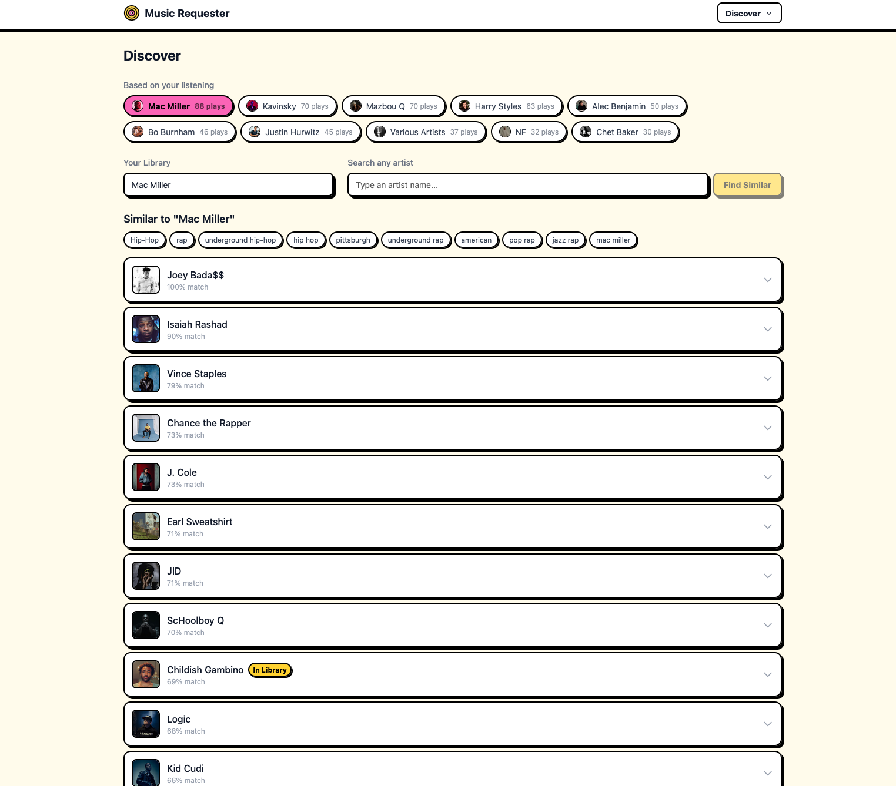

<p align="center">
  
</p>

<h1 align="center">Music Requester</h1>

<p align="center">
  A self-hosted web app for discovering, searching, and requesting music through Lidarr.
</p>

<p align="center">
  
</p>

---

## Features

- **Discover** — Browse artists similar to ones you already listen to. Pulls your top artists from Plex, finds similar artists via Last.fm, and lets you explore by genre tags. Add artists to Lidarr directly from the discovery view.
- **Search** — Search MusicBrainz for albums by title or artist. View track listings, see purchase links (Spotify, Apple Music, Amazon, etc.), and add albums to your Lidarr library.
- **Manual Import** — Upload purchased music files through the web interface. Preview and review files before importing into Lidarr.
- **Status** — Monitor your Lidarr download queue, see missing albums, trigger searches for wanted albums, and view recent imports.
- **Settings** — Configure connections to Lidarr, Last.fm, Plex, and the manual import directory. Test connections and manage quality/metadata profiles.

## Running with Docker Compose

### Prerequisites

- Docker and Docker Compose installed
- A running Lidarr instance
- (Optional) Last.fm API key, Plex server with token

### Setup

1. Create a `docker-compose.yml` file:

```yaml
services:
  music-requester:
    image: ghcr.io/blienuckel/music-requester:latest
    user: "1000:1000"
    ports:
      - "3001:3001"
    volumes:
      - ./config:/config
    restart: unless-stopped
```

If you want to use the manual import feature, also mount the directory where your music files will be uploaded:

```yaml
services:
  music-requester:
    image: ghcr.io/blienuckel/music-requester:latest
    user: "1000:1000"
    ports:
      - "3001:3001"
    volumes:
      - ./config:/config
      - /path/to/your/music/imports:/imports
    restart: unless-stopped
```

2. Start the container:

```sh
docker compose up -d
```

3. Open `http://localhost:3001` in your browser.

4. Go to **Settings** and configure your Lidarr URL, API key, and any other services you want to use.

### Building from source

```sh
git clone git@github.com:BlieNuckel/music-requester.git
cd music-requester
docker compose up -d --build
```

### Configuration

All configuration is stored in `/config/config.json` inside the container. The `./config` volume mount ensures settings persist across container restarts.

| Service | Required | Purpose                                 |
| ------- | -------- | --------------------------------------- |
| Lidarr  | Yes      | Music library management                |
| Last.fm | No       | Artist discovery and genre tags         |
| Plex    | No       | Top artists from your listening history |

MusicBrainz and Deezer are used automatically and do not require configuration.
